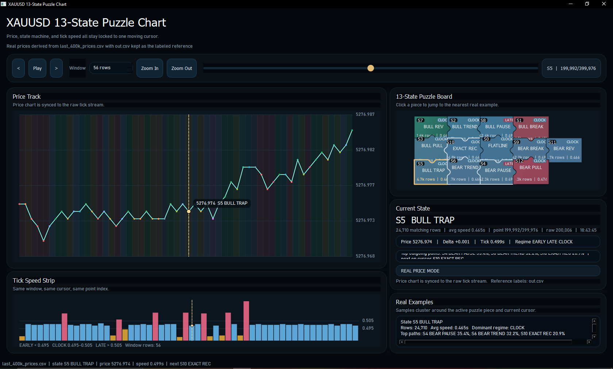

this project analyzes **Pocket Option OTC market data**

# 📊 Financial Market State Transition Analysis Dashboard

An interactive desktop application for analyzing **OTC financial market behavior** using a custom **13-state model**, built with PyQt6.
This project processes high-frequency **XAUUSD (OTC)** price data and visualizes price movement, state transitions, and timing regimes in a synchronized dashboard.

---

## 🚀 Overview

This application transforms raw tick-level **OTC market data** into structured **market states**, enabling deeper insight into:

* Market behavior patterns in OTC conditions
* State transition probabilities
* Timing regimes (EARLY / CLOCK / LATE)
* Price dynamics over time

It combines **data analysis + visualization + state modeling** into a single interactive tool.

---

## 🧠 Key Features

### 📈 Price Chart

* Real-time synchronized price visualization
* State-colored background bands
* Interactive cursor tracking

### ⏱ Tick Speed Analysis

* Visualizes time between ticks
* Classifies regimes:

  * EARLY (< 0.495s)
  * CLOCK (0.495–0.505s)
  * LATE (> 0.505s)

### 🧩 13-State Puzzle Board

* Custom state machine visualization
* Clickable states to jump to real data examples
* Displays:

  * State frequency
  * Average speed
  * Dominant regime
  * Transition probabilities

### 🔄 State Transition Analysis

* Tracks most likely next states
* Displays top transition paths with probabilities

### 🎮 Interactive Controls

* Play / pause time progression
* Zoom in/out on data window
* Slider navigation across dataset
* Jump to nearest state occurrence

---

## 🏗️ Project Structure

```
project/
├── main.py
├── requirements.txt
├── out.csv
├── last_400k_prices.csv
├── README.md
```

---

## 📂 Data Input

The application supports multiple CSV formats:

### 1. Raw Tick Data

Required columns:

* `price`
* `timestamp`

### 2. Labeled Data

Required columns:

* `current_state_id`
* `current_state_name`
* `tick_speed`
* `regime`

### 3. Hybrid (Recommended)

Includes both raw + labeled fields for maximum accuracy and synchronization.

---

## ⚙️ Installation

### 1. Clone repository

```bash
git clone https://github.com/yourusername/project.git
cd project
```

### 2. Install dependencies

```bash
pip install -r requirements.txt
```

---

## ▶️ Usage

### Run application:

```bash
python main.py
```

### Optional arguments:

```bash
python main.py --csv out.csv --raw last_400k_prices.csv
```

### Smoke test (headless):

```bash
python main.py --smoke-test
```

---

## 🧪 How It Works

### 1. State Encoding

Each price movement is converted into a **3-value comparison tuple**, then mapped into one of 13 predefined states representing market behavior.

---

### 2. Regime Classification

Tick speed determines the market regime:

* EARLY → fast/accelerated market
* CLOCK → stable/normal timing
* LATE → slow/delayed market

---

### 3. Transition Modeling

The system tracks:

* Frequency of each state
* Probabilities of transitions between states
* Dominant behavioral patterns

---

### 4. Visualization Engine

Custom rendering using PyQt6:

* No external plotting libraries
* Fully synchronized multi-panel interface
* Real-time interaction with data

---

## 📊 Example Insights

* Identify dominant OTC market regimes
* Detect recurring transition patterns
* Analyze volatility using tick speed
* Explore clustering of market behaviors

---

## 🧱 Technologies Used

* Python
* PyQt6 (GUI framework)
* CSV data processing
* Custom rendering (QPainter)

---

## 🎯 Use Cases

* OTC market analysis
* Financial data exploration
* Quantitative modeling experiments
* Data visualization portfolio project

---

## ⚠️ Limitations

* No predictive model (yet)
* No backtesting engine
* Depends on input data quality
* Designed for analysis, not live trading execution

---

## 🚧 Future Improvements

* Add prediction layer (next-state forecasting)
* Export analytics results to CSV
* Integrate machine learning models
* Add real-time data streaming
* Improve performance for large datasets

---

## 📸 Screenshots

### 🖥 Main Dashboard



---

## 👤 Author

Gerges Elkes
GitHub: https://github.com/GergesElkes

---

## 💡 Note

This project focuses on **OTC (Over-The-Counter) market behavior**, which may differ significantly from live exchange markets in terms of liquidity, timing, and price dynamics.
